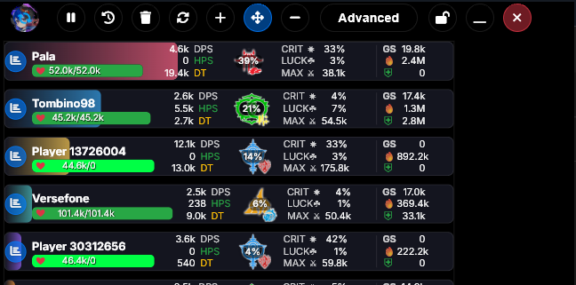
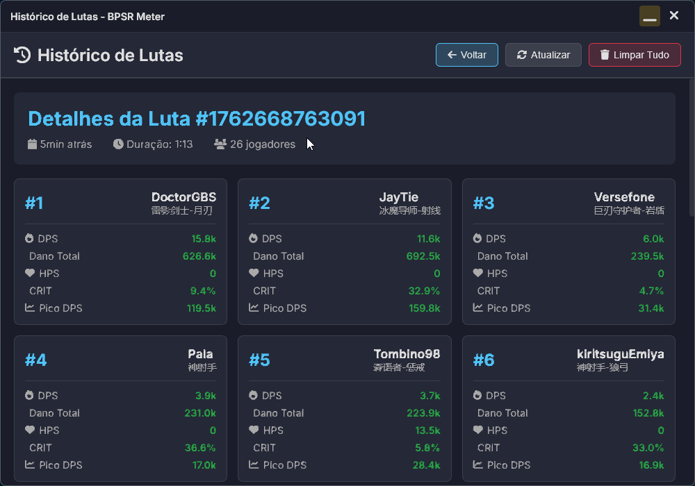
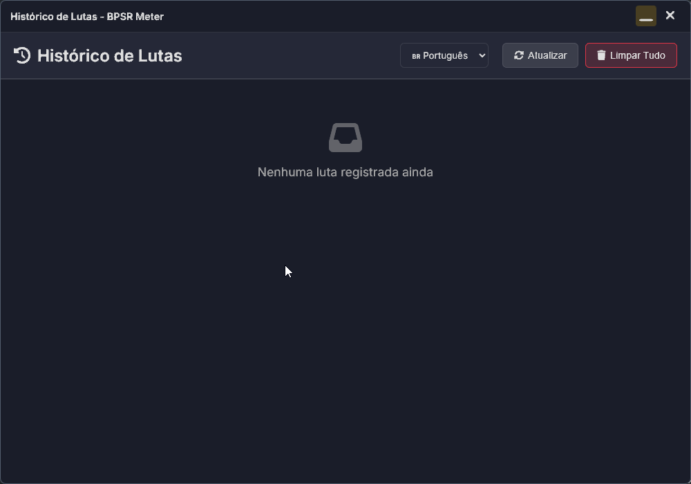

  
  
  # BPSR Meter v3.0.5 (by gabrielsanbs)
  
  ### Medidor de DPS em Tempo Real para Blue Protocol
  
  
  
  [[English](#english)] | [[Español](#español)]
  
  

---

## 🎯 Sobre Esta Versão

**BPSR Meter v3.0.5** é uma versão completamente reformulada e otimizada do medidor de DPS para Blue Protocol. Esta versão inclui novas funcionalidades, melhorias de performance e uma interface mais polida.

**Desenvolvido por:** [gabrielsanbs](https://github.com/gabrielsanbs)  
**Fork de:** [BPSR-Meter](https://github.com/mrsnakke/BPSR-Meter) por MrSnakeVT  
**Projeto original:** [StarResonanceDamageCounter](https://github.com/dmlgzs/StarResonanceDamageCounter) por dmlgzs

> ⚠️ **Uso Responsável:** Esta ferramenta é para análise pessoal de desempenho. Não use para assediar ou discriminar outros jogadores.

---

## ✨ Novidades da Versão 3.0.5

### 📜 Histórico de Combates Multilingue

  

- **3 idiomas suportados:** Português 🇧🇷, English 🇺🇸, Español 🇪🇸
- Histórico completo de todas as batalhas
- Estatísticas detalhadas por luta (DPS, dano total, críticos, sorte)
- Ranking de jogadores em cada combate
- Dados persistem entre sessões

### 🔔 Aviso de Mudança de Mapa

  

- Notificação automática quando detecta nomes temporários
- Lembra você de mudar de mapa para atualizar nomes dos jogadores
- Botão para mostrar/ocultar o aviso

### ⚡ Otimizações de Performance
- **90% menos escritas em disco** com sistema de cache inteligente
- **Uso reduzido de CPU** através de debounce de 3 segundos
- **Interface mais fluida** sem travamentos
- Cache otimizado (salva apenas dados essenciais)

### 🎯 Melhorias na Interface
- ✅ Sistema de arrastar janela totalmente refeito
- ✅ Sem fundo preto ao redimensionar
- ✅ Indicador de carregamento inteligente
- ✅ Transições suaves e responsivas

---

## 📥 Instalação

### Passo 1: Instalar Npcap (Obrigatório)
1. Baixe o [Npcap](https://npcap.com/#download) ou pegue na seção [Releases](../../releases)
2. Execute `npcap-1.83.exe`
3. ⚠️ **Importante:** Marque a opção **"WinPcap API-compatible Mode"**

### Passo 2: Instalar BPSR Meter
1. Baixe o instalador na seção [Releases](../../releases)
2. Execute `BPSR Meter (by gabrielsanbs) Setup 3.0.5.exe`
3. Siga as instruções do instalador
4. Ao terminar, você verá uma mensagem de agradecimento

### Passo 3: Primeira Execução
1. **Execute como Administrador** (botão direito → Executar como administrador)
2. Inicie o jogo Blue Protocol
3. As estatísticas aparecerão automaticamente na tela

---

## ❓ Como Usar

### 🎮️ Controles Principais

|  |  |  |
|:---:|:---:|:---:|
| Modo Avançado | Modo DPS | Modo Healer |

#### Botões:
- **🔄 Arrastar:** Clique e arraste as setas para mover a janela
- **🔒 Travar/Destravar:** Trava a janela (cliques passam para o jogo)
- **➕➖ Zoom:** Aumenta ou diminui o tamanho
- **❌ Fechar:** Fecha a aplicação
- **🧹 F10:** Limpa os dados do combate atual
- **📜 Histórico:** Abre histórico de batalhas (multilingue)
- **🔔 Aviso:** Mostra/esconde notificação de mapa

#### Modos de Visualização:
- **Advanced:** Todas as estatísticas
- **DPS:** Otimizado para classes de dano
- **Lite (Healer):** Otimizado para healers (HPS em destaque)

#### 🌐 Modo ExitLag:
- Clique no botão ExitLag para ativar
- Desativa limpeza automática ao trocar instâncias
- **Config no ExitLag:** Opções → "Método de redireção de pacotes" → **"Antiguo-NDIS"**

---

## ❓ Perguntas Frequentes

**🔐 É banível usar este medidor?**  
Não modifica arquivos do jogo, não injeta código. Ferramentas que apenas leem dados têm baixíssimo risco. **Use por sua conta e risco.**

**⚡ Afeta meu FPS?**  
Não. Versão 3.0.5 é otimizada: 90% menos escritas em disco, cache inteligente, baixo uso de CPU.

**🛡️ Por que precisa de administrador?**  
Para o Npcap acessar adaptadores de rede e monitorar pacotes do jogo.

**✝️ Tem versão para healer?**  
Sim! Modo "Lite" tem botão para alternar entre DPS e Healer, mostrando HPS em destaque.

**📜 O histórico salva todas as lutas?**  
Sim, com estatísticas detalhadas e persistência entre sessões.

**🌐 Posso mudar o idioma?**  
Sim, na janela de Histórico: Português 🇧🇷, English 🇺🇸, Español 🇪🇸

**🌏 Funciona no servidor chinês?**  
Sim, funciona perfeitamente.

---

## ❓ Problemas Comuns

**Não inicia:**
- Instale o Npcap
- Execute como administrador
- Verifique antivírus

**Não mostra dados:**
- Inicie o jogo ANTES do medidor
- Execute como administrador
- Verifique se está na interface de rede correta (VPN/Wi-Fi)

**Dúvidas ou bugs:**
- Veja logs em `%APPDATA%/bpsr-meter`
- Abra uma [Issue no GitHub](../../issues)

---

## 🙏 Créditos

**Desenvolvido por:** [gabrielsanbs](https://github.com/gabrielsanbs)  
**Fork de:** [BPSR-Meter](https://github.com/mrsnakke/BPSR-Meter) por MrSnakeVT  
**Projeto original:** [StarResonanceDamageCounter](https://github.com/dmlgzs/StarResonanceDamageCounter) por dmlgzs

Agradecimentos especiais:
- **MrSnakeVT** por criar o fork que serviu como base para esta versão
- **dmlgzs** por criar o projeto original e torná-lo open source
- **Comunidade Blue Protocol** por feedback e testes

---

## 📜 Licença

AGPL-3.0 - Veja [LICENSE](LICENSE) para detalhes.

---

  
### 🌟 Se gostou do projeto, deixe uma ⭐!

---
---
---

  
  
  # BPSR Meter v3.0.5 (by gabrielsanbs)
  
  ### Real-Time DPS Meter for Blue Protocol
  
  
  
  [[Português](#)] | [[Español](#español)]
  
  

---

## 🎯 About This Version

**BPSR Meter v3.0.5** is a completely redesigned and optimized version of the DPS meter for Blue Protocol. This version includes new features, performance improvements, and a more polished interface.

**Developed by:** [gabrielsanbs](https://github.com/gabrielsanbs)  
**Forked from:** [BPSR-Meter](https://github.com/mrsnakke/BPSR-Meter) by MrSnakeVT  
**Original project:** [StarResonanceDamageCounter](https://github.com/dmlgzs/StarResonanceDamageCounter) by dmlgzs

> ⚠️ **Responsible Use:** This tool is for personal performance analysis. Don't use it to harass or discriminate against other players.

---

## Redes Sociales

---
---

## ✨ What's New in v3.0.5

### 📜 Multilingual Combat History

  

- **3 languages supported:** Português 🇧🇷, English 🇺🇸, Español 🇪🇸
- Complete history of all battles
- Detailed per-fight statistics (DPS, total damage, crits, luck)
- Player rankings in each combat
- Data persists between sessions

### 🔔 Map Change Notice

  

- Automatic notification when temporary names detected
- Reminds you to change maps to update player names
- Toggle button to show/hide notice

### ⚡ Performance Optimizations
- **90% less disk writes** with intelligent cache system
- **Reduced CPU usage** through 3-second debounce
- **Smoother interface** without freezing
- Optimized cache (saves only essential data)

### 🎯 Interface Improvements
- ✅ Completely rebuilt window drag system
- ✅ No black background when resizing
- ✅ Smart loading indicator
- ✅ Smooth and responsive transitions

---

## 📥 Installation

### Step 1: Install Npcap (Required)
1. Download [Npcap](https://npcap.com/#download) or get it from [Releases](../../releases)
2. Run `npcap-1.83.exe`
3. ⚠️ **Important:** Check **"WinPcap API-compatible Mode"**

### Step 2: Install BPSR Meter
1. Download installer from [Releases](../../releases)
2. Run `BPSR Meter (by gabrielsanbs) Setup 3.0.5.exe`
3. Follow installer instructions
4. You'll see a thank you message when finished

### Step 3: First Run
1. **Run as Administrator** (right-click → Run as administrator)
2. Start Blue Protocol
3. Statistics will appear automatically on screen

---

## 🎮 How to Use

### 🎛️ Main Controls

|  |  |  |
|:---:|:---:|:---:|
| Advanced Mode | DPS Mode | Healer Mode |

#### Buttons:
- **🔄 Drag:** Click and drag arrows to move window
- **🔒 Lock/Unlock:** Lock window (clicks pass through to game)
- **➕➖ Zoom:** Increase or decrease size
- **❌ Close:** Close application
- **🧹 F10:** Clear current combat data
- **📜 History:** Open battle history (multilingual)
- **🔔 Notice:** Show/hide map notification

#### Display Modes:
- **Advanced:** All statistics
- **DPS:** Optimized for damage classes
- **Lite (Healer):** Optimized for healers (HPS highlighted)

#### 🌐 ExitLag Mode:
- Click ExitLag button to activate
- Disables automatic clearing when changing instances
- **ExitLag Config:** Options → "Packets Redirection Method" → **"Legacy-NDIS"**
- **ExitLag Configuration:** 
  - Go to Options → "Packets Redirection Method"
  - Make sure it's set to **"Legacy-NDIS"**

---

## 🔧 Troubleshooting

### Logs and Diagnostics
If the application isn't working correctly:

1. **Log file:** Check `iniciar_log.txt` in `%APPDATA%/bpsr-meter`
2. **Debug log:** Check `bpsr-meter-debug.log` in the installation directory
3. **Contact:** You can send me errors via Discord or GitHub Issues

### Common Issues

#### Application won't start:
- Verify that you have **Npcap installed**
- Run as **administrator**
- Check that your antivirus isn't blocking it

#### Not showing data:
1. Make sure the game is running **before** starting the meter
2. Verify you ran the meter **as administrator**
3. If using VPN or multiple connections, the meter might be listening on the wrong one

#### Black background or incorrect interface:
- This version already has fixes for this issue
- If it persists, try restarting the application

---

## ❓ Frequently Asked Questions (FAQ)

### 🔐 Is using this meter a bannable offense?
> It operates in a "gray area." It doesn't modify game files, inject code, or alter the game's memory. Historically, tools that only read data have an extremely low risk of being banned. However, **use it at your own risk.**

### ⚡ Does it affect my game's performance (FPS)?
> No. This version is **optimized for low CPU usage**:
> - Cache system with 3-second debounce
> - 90% reduction in disk writes
> - Optimized update interval
> - Removal of unnecessary data

### 🛡️ Why does it need to run as an administrator?
> To allow the Npcap library to have low-level access to network adapters and monitor the game's packets.

---

## ❓ FAQ

**🔐 Is this bannable?**  
Doesn't modify game files or inject code. Read-only tools have extremely low ban risk. **Use at your own risk.**

**⚡ Does it affect FPS?**  
No. v3.0.5 is optimized: 90% less disk writes, intelligent cache, low CPU usage.

**🛡️ Why run as administrator?**  
Npcap needs low-level network adapter access to monitor game packets.

**💚 Is there a healer version?**  
Yes! "Lite" mode has a button to switch between DPS and Healer, showing HPS highlighted.

**📜 Does history save all fights?**  
Yes, with detailed statistics and persistence between sessions.

**🌐 Can I change language?**  
Yes, in History window: Português, English 🇺🇸, Español 🇪🇸

**🌏 Works on Chinese server?**  
Yes, works perfectly.

---

## 🔧 Troubleshooting

**Won't start:**
- Install Npcap
- Run as administrator
- Check antivirus

**No data showing:**
- Start game BEFORE meter
- Run as administrator
- Check correct network interface (VPN/Wi-Fi)

**Questions or bugs:**
- Check logs in `%APPDATA%/bpsr-meter`
- Open a [GitHub Issue](../../issues)

---

## 🙏 Credits

**Developed by:** [gabrielsanbs](https://github.com/gabrielsanbs)  
**Forked from:** [BPSR-Meter](https://github.com/mrsnakke/BPSR-Meter) by MrSnakeVT  
**Original project:** [StarResonanceDamageCounter](https://github.com/dmlgzs/StarResonanceDamageCounter) by dmlgzs

Special thanks:
- **MrSnakeVT** for creating the fork that served as the foundation for this version
- **dmlgzs** for creating the original project and making it open source
- **Blue Protocol Community** for feedback and testing

---

## 📜 License

AGPL-3.0 - See [LICENSE](LICENSE) for details.

---

  
### 🌟 If you liked the project, leave a ⭐!

---
---
---

  
  
  # BPSR Meter v3.0.5 (by gabrielsanbs)
  
  ### Medidor de DPS en Tiempo Real para Blue Protocol
  
  
  
  [[Português](#)] | [[English](#english)]
  
  

---

## 🎯 Sobre Esta Versión

**BPSR Meter v3.0.5** es una versión completamente rediseñada y optimizada del medidor de DPS para Blue Protocol. Esta versión incluye nuevas funcionalidades, mejoras de rendimiento y una interfaz más pulida.

**Desarrollado por:** [gabrielsanbs](https://github.com/gabrielsanbs)  
**Fork de:** [BPSR-Meter](https://github.com/mrsnakke/BPSR-Meter) por MrSnakeVT  
**Proyecto original:** [StarResonanceDamageCounter](https://github.com/dmlgzs/StarResonanceDamageCounter) por dmlgzs

> ⚠️ **Uso Responsable:** Esta herramienta es para análisis personal de rendimiento. No la uses para acosar o discriminar a otros jugadores.

---

## ✨ Novedades de v3.0.5

### 📜 Historial de Combates Multilingüe

  

- **3 idiomas soportados:** Português 🇧🇷, English 🇺🇸, Español 🇪🇸
- Historial completo de todas las batallas
- Estadísticas detalladas por pelea (DPS, daño total, críticos, suerte)
- Ranking de jugadores en cada combate
- Datos persisten entre sesiones

### 🔔 Aviso de Cambio de Mapa

  

- Notificación automática cuando detecta nombres temporales
- Te recuerda cambiar de mapa para actualizar nombres de jugadores
- Botón para mostrar/ocultar el aviso

### ⚡ Optimizaciones de Rendimiento
- **90% menos escrituras en disco** con sistema de caché inteligente
- **Uso reducido de CPU** mediante debounce de 3 segundos
- **Interfaz más fluida** sin congelamientos
- Caché optimizado (guarda solo datos esenciales)

### 🎯 Mejoras en la Interfaz
- ✅ Sistema de arrastre de ventana completamente rehecho
- ✅ Sin fondo negro al redimensionar
- ✅ Indicador de carga inteligente
- ✅ Transiciones suaves y responsivas

---

## 📥 Instalación

### Paso 1: Instalar Npcap (Obligatorio)
1. Descarga [Npcap](https://npcap.com/#download) o consíguelo en [Releases](../../releases)
2. Ejecuta `npcap-1.83.exe`
3. ⚠️ **Importante:** Marca la opción **"WinPcap API-compatible Mode"**

### Paso 2: Instalar BPSR Meter
1. Descarga el instalador en [Releases](../../releases)
2. Ejecuta `BPSR Meter (by gabrielsanbs) Setup 3.0.5.exe`
3. Sigue las instrucciones del instalador
4. Al terminar, verás un mensaje de agradecimiento

### Paso 3: Primera Ejecución
1. **Ejecuta como Administrador** (clic derecho → Ejecutar como administrador)
2. Inicia Blue Protocol
3. Las estadísticas aparecerán automáticamente en pantalla

---

## 🎮 Cómo Usar

### 🎛️ Controles Principales

|  |  |  |
|:---:|:---:|:---:|
| Modo Avanzado | Modo DPS | Modo Healer |

#### Botones:
- **🔄 Arrastrar:** Haz clic y arrastra las flechas para mover la ventana
- **🔒 Bloquear/Desbloquear:** Bloquea la ventana (clics pasan al juego)
- **➕➖ Zoom:** Aumenta o disminuye el tamaño
- **❌ Cerrar:** Cierra la aplicación
- **🧹 F10:** Limpia los datos del combate actual
- **📜 Historial:** Abre historial de batallas (multilingüe)
- **🔔 Aviso:** Muestra/oculta notificación de mapa

#### Modos de Visualización:
- **Advanced:** Todas las estadísticas
- **DPS:** Optimizado para clases de daño
- **Lite (Healer):** Optimizado para sanadores (HPS destacado)

#### 🌐 Modo ExitLag:
- Haz clic en el botón ExitLag para activar
- Desactiva limpieza automática al cambiar instancias
- **Config en ExitLag:** Opciones → "Método de redirección de paquetes" → **"Antiguo-NDIS"**

---

## ❓ Preguntas Frecuentes

**🔐 ¿Es baneable?**  
No modifica archivos del juego ni inyecta código. Herramientas de solo lectura tienen riesgo de baneo extremadamente bajo. **Usa bajo tu propia responsabilidad.**

**⚡ ¿Afecta los FPS?**  
No. v3.0.5 está optimizada: 90% menos escrituras en disco, caché inteligente, bajo uso de CPU.

**🛡️ ¿Por qué ejecutar como administrador?**  
Npcap necesita acceso de bajo nivel a adaptadores de red para monitorear paquetes del juego.

**💚 ¿Hay versión para healer?**  
¡Sí! Modo "Lite" tiene botón para alternar entre DPS y Healer, mostrando HPS destacado.

**📜 ¿El historial guarda todas las peleas?**  
Sí, con estadísticas detalladas y persistencia entre sesiones.

**🌐 ¿Puedo cambiar el idioma?**  
Sí, en la ventana Historial: Português 🇧🇷, English 🇺🇸, Español 🇪🇸

**🌏 ¿Funciona en el servidor chino?**  
Sí, funciona perfectamente.

---

## ❓ Solución de Problemas

**No inicia:**
- Instala Npcap
- Ejecuta como administrador
- Verifica antivirus

**No muestra datos:**
- Inicia el juego ANTES del medidor
- Ejecuta como administrador
- Verifica interfaz de red correcta (VPN/Wi-Fi)

**Dudas o bugs:**
- Revisa logs en `%APPDATA%/bpsr-meter`
- Abre un [Issue en GitHub](../../issues)

---

## 🙏 Créditos

**Desarrollado por:** [gabrielsanbs](https://github.com/gabrielsanbs)  
**Fork de:** [BPSR-Meter](https://github.com/mrsnakke/BPSR-Meter) por MrSnakeVT  
**Proyecto original:** [StarResonanceDamageCounter](https://github.com/dmlgzs/StarResonanceDamageCounter) por dmlgzs

Agradecimientos especiales:
- **MrSnakeVT** por crear el fork que sirvió como base para esta versión
- **dmlgzs** por crear el proyecto original y hacerlo open source
- **Comunidad Blue Protocol** por feedback y pruebas

---

## 📜 Licencia

AGPL-3.0 - Ver [LICENSE](LICENSE) para detalles.

---

  
### 🌟 ¡Si te gustó el proyecto, deja una ⭐!

**Developed with ❤️ by [gabrielsanbs](https://github.com/gabrielsanbs)**

