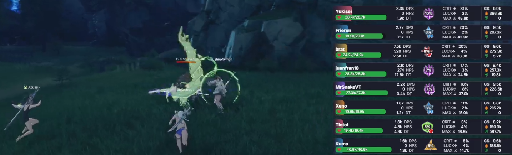
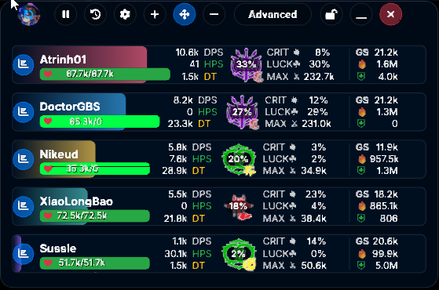
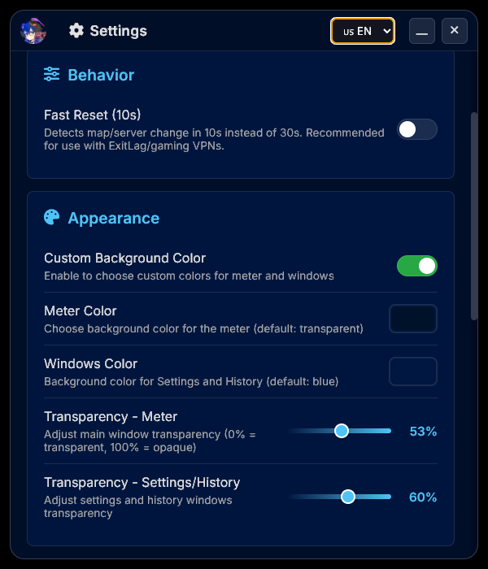
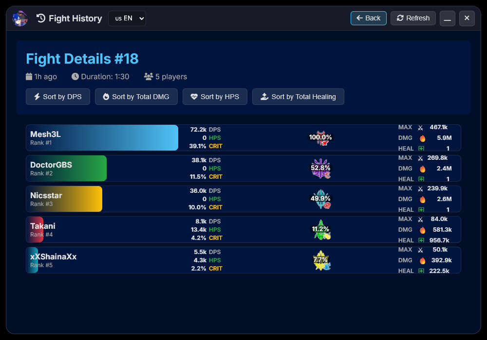
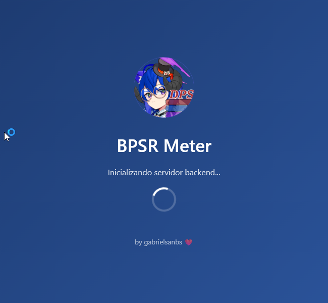
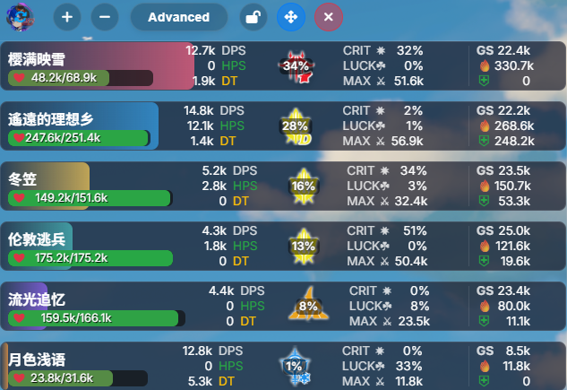
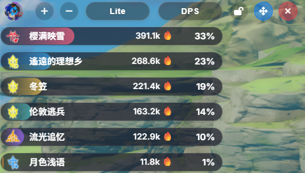
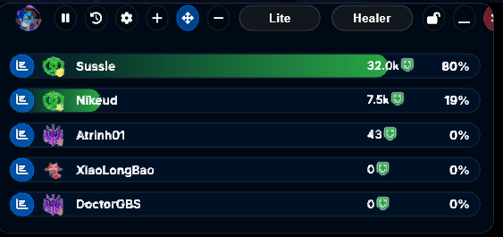

  
  
  # BPSR Meter v3.1.1 (by gabrielsanbs)
  
  ### Medidor de DPS em Tempo Real para Blue Protocol
  
  
  
  [[Português](#)] | [[English](#english)] | [[Español](#español)]
  
  

---

## 🎯 Sobre Esta Versão

**BPSR Meter v3.1.1** é uma versão com correções importantes de estabilidade e otimização de memória, além de melhorias de performance e suporte total a VPNs de jogos.

**Desenvolvido por:** [gabrielsanbs](https://github.com/gabrielsanbs)  
**Fork de:** [BPSR-Meter](https://github.com/mrsnakke/BPSR-Meter) por MrSnakeVT  
**Projeto original:** [StarResonanceDamageCounter](https://github.com/dmlgzs/StarResonanceDamageCounter) por dmlgzs

> ⚠️ **Uso Responsável:** Esta ferramenta é para análise pessoal de desempenho. Não use para assediar ou discriminar outros jogadores.

---

## ✨ Novidades da Versão 3.1.1

### ⚙️ Tela de Configurações Completa

  

- **Configurações em tempo real** sem necessidade de reiniciar
- **Limite de jogadores exibidos** (1-20 jogadores)
- **Reset automático** de lutas
- **Limpeza de cache** de usuários
- **Seletor de idioma** integrado (PT-BR 🇧🇷, EN 🇺🇸, ES 🇪🇸)
- Interface arrastável e moderna

### 📜 Histórico de Combates Avançado

  

- **4 modos de ordenação:** DPS, DMG Total, HPS, Healing Total
- **3 idiomas suportados:** Português 🇧🇷, English 🇺🇸, Español 🇪🇸
- Histórico completo com **numeração sequencial** (Luta #1, #2, #3...)
- Estatísticas detalhadas por luta (DPS, dano total, críticos, sorte)
- **Ícones de classe** para todas as 27 especializações
- Ranking de jogadores em cada combate
- **Auto-salvamento** ao trocar de mapa/servidor
- Dados persistem entre sessões

### 🔔 Aviso de Mudança de Mapa

  

- Notificação automática quando detecta nomes temporários
- Lembra você de mudar de mapa para atualizar nomes dos jogadores
- Botão para mostrar/ocultar o aviso

### 🌐 Suporte Completo a VPNs de Jogos
- **ExitLag** ✅
- **NoPing** ✅
- **WTFast** ✅
- **Mudfish** ✅
- **PingZapper, PingEnhancer, Haste, Outfox, BattlePing** ✅
- Detecção automática de adaptadores TAP de VPNs
  - Sem necessidade de configuração manual

Nota importante para usuários de VPN: se você usa VPNs (ExitLag, NoPing, etc.), **habilite o modo "Legacy NDIS" / "WinPcap API-compatible Mode" no cliente da VPN**. Alguns provedores reescrevem o roteamento de pacotes e evitam que o Npcap capture o tráfego do jogo; o modo Legacy NDIS restaura compatibilidade e evita perda de pacotes ou picos de memória ao trocar de mapa.

 - ExitLag: Opções → Método de redireção de pacotes → **Legacy NDIS** (ou "Antiguo-NDIS")
 - NoPing / outros: habilite compatibilidade com WinPcap / Legacy NDIS quando disponível

### ⚡ Otimizações de Performance & Correções de Memória
- **90% menos escritas em disco** com sistema de cache inteligente
- Correção de vazamento de memória ao trocar de mapa: o processador de pacotes agora processa pacotes sequencialmente (evita acumular Promises com buffers), possui limpeza de cache TCP automática (TTL 15s) e limite de entradas para prevenir explosões de memória com tráfego intenso.

- Melhor rastreamento de mudança de servidor/mapa: agora o sistema limpa corretamente caches e lógicas quando o jogo troca de servidor/mapa.
- **Uso reduzido de CPU** através de debounce de 3 segundos
- **Interface mais fluida** com update de 50ms
- Cache otimizado (salva apenas dados essenciais)
- **Auto-salvamento inteligente** de histórico ao trocar mapas

### 🎯 Interface Improvements
- ✅ **Loading screen** redesigned with main icon
- ✅ Window dragging system completely rebuilt
- ✅ **No black background** when resizing
- ✅ **Spinning icon removed** when no active fight
- ✅ **Buttons without selection effect** after click
- ✅ Smooth and responsive transitions
- ✅ Interface automatically adjusts to player count

---

## 📥 Instalação

### Passo 1: Instalar Npcap (Obrigatório)
1. Baixe o [Npcap](https://npcap.com/#download) ou pegue na seção [Releases](../../releases)
2. Execute `npcap-1.83.exe`
3. ⚠️ **Importante:** Marque a opção **"WinPcap API-compatible Mode"**

### Passo 2: Instalar o BPSR Meter
1. Baixe o instalador na seção [Releases](../../releases)
2. Execute `BPSR Meter (by gabrielsanbs) Setup 3.1.1.exe`
3. Siga as instruções do instalador
4. Ao finalizar, você verá uma mensagem de agradecimento

### Passo 3: Primeira Execução
1. **Execute como Administrador** (botão direito → Executar como administrador)
2. Inicie o jogo Blue Protocol
3. As estatísticas aparecerão automaticamente na tela

---

## ❓ Como Usar

### 🎮️ Controles Principais

|  |  |  |
|:---:|:---:|:---:|
| Modo Avançado | Modo DPS | Modo Healer |

#### Botões:
- **🔄 Arrastar:** Clique e arraste as setas para mover a janela
- **🔒 Travar/Destravar:** Trava a janela (cliques passam para o jogo)
- **➕➖ Zoom:** Aumenta ou diminui o tamanho
- **❌ Fechar:** Fecha a aplicação
- **🧹 F10:** Limpa os dados do combate atual
- **📜 Histórico:** Abre histórico de batalhas (ordenação por DPS/HPS)
- **⚙️ Configurações:** Abre tela de settings em tempo real
- **🔔 Aviso:** Mostra/esconde notificação de mapa

#### Modos de Visualização:
- **Advanced:** Todas as estatísticas
- **DPS:** Otimizado para classes de dano
- **Lite (Healer):** Otimizado para healers (HPS em destaque)

#### 🌐 Suporte a VPNs de Jogos:
- **Suporte automático** para ExitLag, NoPing, WTFast, Mudfish e outras VPNs
- Detecta e permite adaptadores TAP de VPNs de jogos
- **Config no ExitLag:** Opções → "Método de redireção de pacotes" → **"Antiguo-NDIS"**
- Não requer configuração adicional para outras VPNs

#### ⚙️ Configurações:
- **Limite de jogadores:** 1-20 jogadores visíveis
- **Reset automático:** Limpa dados automaticamente
- **Idioma:** PT-BR, English, Español
- **Cache:** Limpeza de cache de usuários
- **Histórico:** Limpeza completa de lutas salvas

---

## ❓ Perguntas Frequentes

**🔐 É banível usar este medidor?**  
Não modifica arquivos do jogo, não injeta código. Ferramentas que apenas leem dados têm baixíssimo risco. **Use por sua conta e risco.**

**⚡ Afeta meu FPS?**  
Não. Versão 3.1.1 é otimizada: 90% menos escritas em disco, cache inteligente, baixo uso de CPU.

**🛡️ Por que precisa de administrador?**  
Para o Npcap acessar adaptadores de rede e monitorar pacotes do jogo.

**💚 Tem versão para healer?**  
Sim! Modo "Lite" tem botão para alternar entre DPS e Healer, mostrando HPS em destaque.

**📜 O histórico salva todas as lutas?**  
Sim! Salva automaticamente até 20 lutas com estatísticas detalhadas. Persiste entre sessões e **auto-salva ao trocar de mapas**.

**🌐 Posso mudar o idioma?**  
Sim! Na janela de **Configurações** ou **Histórico**: Português 🇧🇷, English 🇺🇸, Español 🇪🇸

**🔀 Posso ordenar por HPS no histórico?**  
Sim! 4 modos: **DPS**, **DMG Total**, **HPS**, **Healing Total**

**🌐 Funciona com ExitLag/NoPing?**  
Sim! **Suporte automático** para todas as VPNs gaming (ExitLag, NoPing, WTFast, Mudfish, etc)

** Funciona no servidor chinês?**  
Sim, funciona perfeitamente.

---

## 🔧 Solução de Problemas

---

## ❓ Problemas Comuns

**Não inicia:**
- Instale o Npcap
- Execute como administrador
- Verifique antivírus

**Não mostra dados:**
- Inicie o jogo ANTES do medidor
- Execute como administrador
- Se usar **VPN de jogo** (ExitLag, NoPing), o medidor deve detectar automaticamente
- Verifique logs em `%APPDATA%/bpsr-meter/iniciar_log.txt`

**Dúvidas ou bugs:**
- Veja logs em `%APPDATA%/bpsr-meter`
- Abra uma [Issue no GitHub](../../issues)

---

## 🙏 Créditos

**Desenvolvido por:** [gabrielsanbs](https://github.com/gabrielsanbs)  
**Fork de:** [BPSR-Meter](https://github.com/mrsnakke/BPSR-Meter) por MrSnakeVT  
**Projeto original:** [StarResonanceDamageCounter](https://github.com/dmlgzs/StarResonanceDamageCounter) por dmlgzs

Agradecimentos especiais:
- **MrSnakeVT** por criar o fork que serviu como base para esta versão
- **dmlgzs** por criar o projeto original e torná-lo open source
- **Comunidade Blue Protocol** por feedback e testes

---

## 📜 Licença

AGPL-3.0 - Veja [LICENSE](LICENSE) para detalhes.

---

  
### 🌟 Se gostou do projeto, deixe uma ⭐!

---
---
---

  
  
  # BPSR Meter v3.1.1 (by gabrielsanbs)
  
  ### Real-Time DPS Meter for Blue Protocol
  
  
  
  [[Português](#)] | [[Español](#español)]
  
  

---

## 🎯 About This Version

**BPSR Meter v3.1.1** is a bugfix & maintenance release that includes memory & stability improvements for map/server changes, and better VPN handling.

**Developed by:** [gabrielsanbs](https://github.com/gabrielsanbs)  
**Forked from:** [BPSR-Meter](https://github.com/mrsnakke/BPSR-Meter) by MrSnakeVT  
**Original project:** [StarResonanceDamageCounter](https://github.com/dmlgzs/StarResonanceDamageCounter) by dmlgzs

> ⚠️ **Responsible Use:** This tool is for personal performance analysis. Don't use it to harass or discriminate against other players.

---

## Social Links

---
---

## ✨ What's New in v3.1.1

### ⚙️ Complete Settings Screen

  

- **Real-time configuration** without restart required
- **Player display limit** (1-20 players)
- **Auto-reset** fights
- **Cache cleanup** for users
- **Integrated language selector** (PT-BR 🇧🇷, EN 🇺🇸, ES 🇪🇸)
- Draggable and modern interface

### 📜 Advanced Combat History

  

- **4 sorting modes:** DPS, Total DMG, HPS, Total Healing
- **3 languages supported:** Português 🇧🇷, English 🇺🇸, Español 🇪🇸
- Complete history with **sequential numbering** (Fight #1, #2, #3...)
- Detailed per-fight statistics (DPS, total damage, crits, luck)
- **Class icons** for all 27 specializations
- Player rankings in each combat
- **Auto-save** when changing map/server
- Data persists between sessions

- Fix memory growth on map changes: improved TCP cache management (TTL and max size), and sequential awaited packet processing to avoid buffered Promises holding packet buffers.

### 🔔 Map Change Notice

  

- Automatic notification when temporary names detected
- Reminds you to change maps to update player names
- Toggle button to show/hide notice

### 🌐 Full Gaming VPN Support
- **ExitLag** ✅
- **NoPing** ✅
- **WTFast** ✅
- **Mudfish** ✅
- **PingZapper, PingEnhancer, Haste, Outfox, BattlePing** ✅
- Automatic detection of VPN TAP adapters
- No manual configuration needed

Important note for VPN users: if you use third-party gaming VPNs (ExitLag, NoPing, WTFast, etc.), enable the "Legacy NDIS" / "WinPcap API-compatible Mode" inside the VPN client. Some VPN adapters use advanced redirection that prevents packet capture; Legacy NDIS ensures Npcap receives game packets correctly.

 - ExitLag: Options → Packet Redirection Method → **Legacy NDIS** (or "Antiguo-NDIS")
 - NoPing & others: enable WinPcap compatibility or Legacy NDIS when available

If this is not enabled, you may see missing packets, wrong statistics, or RAM spikes after map changes.

### ⚡ Performance Optimizations
- **90% less disk writes** with intelligent cache system
- **Reduced CPU usage** through 3-second debounce
- **Smoother interface** with 50ms update rate
- Optimized cache (saves only essential data)
- **Smart auto-save** of history when changing maps

### 🎯 Interface Improvements
- ✅ **Loading screen** redesigned with main icon
- ✅ Completely rebuilt window drag system
- ✅ **No black background** when resizing
- ✅ **Spinning icon removed** when no active fight
- ✅ **Buttons without selection effect** after click
- ✅ Smooth and responsive transitions
- ✅ Interface automatically adjusts to player count

---

## 📥 Installation

### Step 1: Install Npcap (Required)
1. Download [Npcap](https://npcap.com/#download) or get it from [Releases](../../releases)
2. Run `npcap-1.83.exe`
3. ⚠️ **Important:** Check **"WinPcap API-compatible Mode"**

### Step 2: Install BPSR Meter
1. Download installer from [Releases](../../releases)
2. Run `BPSR Meter (by gabrielsanbs) Setup 3.1.1.exe`
3. Follow installer instructions
4. You'll see a thank you message when finished

### Step 3: First Run
1. **Run as Administrator** (right-click → Run as administrator)
2. Start Blue Protocol
3. Statistics will appear automatically on screen

---

## 🎮 How to Use

### 🎛️ Main Controls

|  |  |  |
|:---:|:---:|:---:|
| Advanced Mode | DPS Mode | Healer Mode |

#### Buttons:
- **🔄 Drag:** Click and drag the arrows to move the window
- **🔒 Lock/Unlock:** Locks the window (clicks pass to the game)
- **➕➖ Zoom:** Increase or decrease size
- **❌ Close:** Close application
- **🧹 F10:** Clear current combat data
- **📜 History:** Open battle history (DPS/HPS sorting)
- **⚙️ Settings:** Open real-time settings screen
- **🔔 Notice:** Show/hide map notification

#### Display Modes:
- **Advanced:** All statistics
- **DPS:** Optimized for damage classes
- **Lite (Healer):** Optimized for healers (HPS highlighted)

#### 🌐 Gaming VPN Support:
- **Automatic support** for ExitLag, NoPing, WTFast, Mudfish and other VPNs
- Detects and allows TAP adapters from gaming VPNs
- **ExitLag Config:** Options → "Packet Redirection Method" → **"Legacy-NDIS"**
- No additional configuration required for other VPNs
 
Important note for VPN users: if you use third-party gaming VPNs (ExitLag, NoPing, WTFast, etc.) enable the "Legacy NDIS" / "WinPcap API-compatible Mode" in the VPN client. Some VPNs use modern NDIS/TAP redirection that prevents packet capture; Legacy NDIS restores compatibility and avoids missing packets or memory spikes after map changes.

 - ExitLag: Options → Packet Redirection Method → **Legacy NDIS**
 - NoPing & others: enable WinPcap compatibility / Legacy NDIS where available

#### ⚙️ Settings:
- **Player limit:** 1-20 visible players
- **Auto-reset:** Clears data automatically
- **Language:** PT-BR, English, Español
- **Cache:** User cache cleanup
- **History:** Complete cleanup of saved fights

---

## 🔧 Troubleshooting

### Logs and Diagnostics
If the application isn't working correctly:

1. **Log file:** Check `iniciar_log.txt` in `%APPDATA%/bpsr-meter`
2. **Debug log:** Check `bpsr-meter-debug.log` in the installation directory
3. **Contact:** You can send me errors via Discord or GitHub Issues

### Common Issues

#### Application won't start:
- Verify that you have **Npcap installed**
- Run as **administrator**
- Check that your antivirus isn't blocking it

#### Not showing data:
1. Make sure the game is running **before** starting the meter
2. Verify you ran the meter **as administrator**
3. If using **gaming VPN** (ExitLag, NoPing), the meter should detect automatically
4. Check logs in `%APPDATA%/bpsr-meter/iniciar_log.txt`

#### Black background or incorrect interface:
- This version already has fixes for this issue
- If it persists, try restarting the application

---

## ❓ FAQ

**🔐 Is this bannable?**  
Doesn't modify game files or inject code. Read-only tools have extremely low ban risk. **Use at your own risk.**

**⚡ Does it affect FPS?**  
No. v3.1.1 is optimized: 90% less disk writes, intelligent cache, low CPU usage.

**🛡️ Why run as administrator?**  
Npcap needs low-level network adapter access to monitor game packets.

**💚 Is there a healer version?**  
Yes! "Lite" mode has a button to switch between DPS and Healer, showing HPS highlighted.

**📜 Does history save all fights?**  
Yes! Automatically saves up to 20 fights with detailed statistics. Persists between sessions and **auto-saves when changing maps**.

**🌐 Can I change language?**  
Yes! In **Settings** or **History** window: Português 🇧🇷, English 🇺🇸, Español 🇪🇸

**🔀 Can I sort by HPS in history?**  
Yes! 4 sorting modes: **DPS**, **Total DMG**, **HPS**, **Total Healing**

**🌐 Does it work with ExitLag/NoPing?**  
Yes! **Automatic support** for all popular gaming VPNs (ExitLag, NoPing, WTFast, Mudfish, etc)

**🌏 Works on Chinese server?**  
Yes, works perfectly.

---

## 🙏 Credits

**Developed by:** [gabrielsanbs](https://github.com/gabrielsanbs)  
**Forked from:** [BPSR-Meter](https://github.com/mrsnakke/BPSR-Meter) by MrSnakeVT  
**Original project:** [StarResonanceDamageCounter](https://github.com/dmlgzs/StarResonanceDamageCounter) by dmlgzs

Special thanks:
- **MrSnakeVT** for creating the fork that served as the foundation for this version
- **dmlgzs** for creating the original project and making it open source
- **Blue Protocol Community** for feedback and testing

---

## 📜 License

AGPL-3.0 - See [LICENSE](LICENSE) for details.

---

  
### 🌟 If you liked the project, leave a ⭐!

---
---
---

  
  
  # BPSR Meter v3.1.1 (by gabrielsanbs)
  
  ### Medidor de DPS en Tiempo Real para Blue Protocol
  
  
  
  [[Português](#)] | [[English](#english)]
  
  

---

## 🎯 Sobre Esta Versión

**BPSR Meter v3.1.1** es una versión con correcciones de estabilidad y memoria, mejoras de rendimiento y mejor manejo de VPNs.

**Desarrollado por:** [gabrielsanbs](https://github.com/gabrielsanbs)  
**Fork de:** [BPSR-Meter](https://github.com/mrsnakke/BPSR-Meter) por MrSnakeVT  
**Proyecto original:** [StarResonanceDamageCounter](https://github.com/dmlgzs/StarResonanceDamageCounter) por dmlgzs

> ⚠️ **Uso Responsable:** Esta herramienta es para análisis personal de rendimiento. No la uses para acosar o discriminar a otros jugadores.

---

## ✨ Novedades de v3.1.1

### ⚙️ Pantalla de Configuración Completa

  

- **Configuración en tiempo real** sin necesidad de reiniciar
- **Límite de jugadores mostrados** (1-20 jugadores)
- **Reset automático** de combates
- **Limpieza de caché** de usuarios
- **Selector de idioma** integrado (PT-BR 🇧🇷, EN 🇺🇸, ES 🇪🇸)
- Interfaz arrastrable y moderna

### 📜 Historial de Combate Avanzado

  

- **4 modos de ordenación:** DPS, DMG Total, HPS, Healing Total
- **3 idiomas soportados:** Português 🇧🇷, English 🇺🇸, Español 🇪🇸
- Historial completo con **numeración secuencial** (Combate #1, #2, #3...)
- Estadísticas detalladas por combate (DPS, daño total, críticos, suerte)
- **Iconos de clase** para las 27 especializaciones
- Ranking de jugadores en cada combate
- **Auto-guardado** al cambiar de mapa/servidor
- Datos persisten entre sesiones

- Corrección de crecimiento de memoria al cambiar de mapa: mejoras en la gestión del caché TCP (TTL y tamaño máximo) y procesamiento secuencial de paquetes para evitar acumulación de Promises con buffers.

### 🔔 Aviso de Cambio de Mapa

  

- Notificación automática cuando detecta nombres temporales
- Te recuerda cambiar de mapa para actualizar nombres de jugadores
- Botón para mostrar/ocultar el aviso

### 🌐 Soporte Completo para VPNs Gaming
- **ExitLag** ✅
- **NoPing** ✅
- **WTFast** ✅
- **Mudfish** ✅
- **PingZapper, PingEnhancer, Haste, Outfox, BattlePing** ✅
- Detección automática de adaptadores TAP de VPNs
- Sin necesidad de configuración manual

Nota importante para usuarios de VPN: si usas VPNs gaming (ExitLag, NoPing, WTFast, etc.), activa **Antiguo-NDIS** / **Modo compatible con WinPcap** en las opciones de tu cliente VPN. Algunos proveedores reescriben el ruteo y evitan que Npcap reciba los paquetes del juego; Antiguo-NDIS restablece la compatibilidad y evita paquetes perdidos o picos de memoria al cambiar mapas.

 - ExitLag: Opciones → Método de redirección de paquetes → **Antiguo-NDIS**
 - NoPing y otros: habilita compatibilidad con WinPcap / Antiguo-NDIS cuando esté disponible

### ⚡ Optimizaciones de Rendimiento
- **90% menos escrituras en disco** con sistema de caché inteligente
- **Uso reducido de CPU** mediante debounce de 3 segundos
- **Interfaz más fluida** con actualización de 50ms
- Caché optimizado (guarda solo datos esenciales)
- **Auto-guardado inteligente** del historial al cambiar mapas

### 🎯 Mejoras en la Interfaz
- ✅ **Pantalla de carga** rediseñada con icono principal
- ✅ Sistema de arrastre de ventana completamente rehecho
- ✅ **Sin fondo negro** al redimensionar
- ✅ **Icono giratorio removido** cuando no hay combate activo
- ✅ **Botones sin efecto de selección** después del clic
- ✅ Transiciones suaves y responsivas
- ✅ Interfaz se ajusta automáticamente al número de jugadores

---

## 📥 Instalación

### Paso 1: Instalar Npcap (Obligatorio)
1. Descarga [Npcap](https://npcap.com/#download) o consíguelo en [Releases](../../releases)
2. Ejecuta `npcap-1.83.exe`
3. ⚠️ **Importante:** Marca la opción **"WinPcap API-compatible Mode"**

### Paso 2: Instalar BPSR Meter
1. Descarga el instalador en [Releases](../../releases)
2. Ejecuta `BPSR Meter (by gabrielsanbs) Setup 3.1.1.exe`
3. Sigue las instrucciones del instalador
4. Al terminar, verás un mensaje de agradecimiento

### Paso 3: Primera Ejecución
1. **Ejecuta como Administrador** (clic derecho → Ejecutar como administrador)
2. Inicia Blue Protocol
3. Las estadísticas aparecerán automáticamente en pantalla

---

## 🎮 Cómo Usar

### 🎛️ Controles Principales

|  |  |  |
|:---:|:---:|:---:|
| Modo Avanzado | Modo DPS | Modo Healer |

#### Botones:
- **🔄 Arrastrar:** Haz clic y arrastra las flechas para mover la ventana
- **🔒 Bloquear/Desbloquear:** Bloquea la ventana (clics pasan al juego)
- **➕➖ Zoom:** Aumenta o disminuye el tamaño
- **❌ Cerrar:** Cierra la aplicación
- **🧹 F10:** Limpia los datos del combate actual
- **📜 Historial:** Abre historial de batallas (ordenación DPS/HPS)
- **⚙️ Configuración:** Abre pantalla de settings en tiempo real
- **🔔 Aviso:** Muestra/oculta notificación de mapa

#### Modos de Visualización:
- **Advanced:** Todas las estadísticas
- **DPS:** Optimizado para clases de daño
- **Lite (Healer):** Optimizado para sanadores (HPS destacado)

#### 🌐 Soporte para VPNs Gaming:
- **Soporte automático** para ExitLag, NoPing, WTFast, Mudfish y otras VPNs
- Detecta y permite adaptadores TAP de VPNs gaming
- **Config en ExitLag:** Opciones → "Método de redirección de paquetes" → **"Antiguo-NDIS"**
- No requiere configuración adicional para otras VPNs

#### ⚙️ Configuración:
- **Límite de jugadores:** 1-20 jugadores visibles
- **Reset automático:** Limpia datos automáticamente
- **Idioma:** PT-BR, English, Español
- **Caché:** Limpieza de caché de usuarios
- **Historial:** Limpieza completa de combates guardados

---

## ❓ Preguntas Frecuentes

**🔐 ¿Es baneable?**  
No modifica archivos del juego ni inyecta código. Herramientas de solo lectura tienen riesgo de baneo extremadamente bajo. **Usa bajo tu propia responsabilidad.**

**⚡ ¿Afecta los FPS?**  
No. v3.1.1 está optimizada: 90% menos escrituras en disco, caché inteligente, bajo uso de CPU.

**🛡️ ¿Por qué ejecutar como administrador?**  
Npcap necesita acceso de bajo nivel a adaptadores de red para monitorear paquetes del juego.

**💚 ¿Hay versión para healer?**  
¡Sí! Modo "Lite" tiene botón para alternar entre DPS y Healer, mostrando HPS destacado.

**📜 ¿El historial guarda todas las peleas?**  
¡Sí! Guarda automáticamente hasta 20 combates con estadísticas detalladas. Persiste entre sesiones y **auto-guarda al cambiar mapas**.

**🌐 ¿Puedo cambiar el idioma?**  
¡Sí! En la ventana de **Configuración** o **Historial**: Português 🇧🇷, English 🇺🇸, Español 🇪🇸

**🔀 ¿Puedo ordenar por HPS en el historial?**  
¡Sí! 4 modos de ordenación: **DPS**, **DMG Total**, **HPS**, **Healing Total**

**🌐 ¿Funciona con ExitLag/NoPing?**  
¡Sí! **Soporte automático** para todas las VPNs gaming populares (ExitLag, NoPing, WTFast, Mudfish, etc)

**🌏 ¿Funciona en el servidor chino?**  
Sí, funciona perfectamente.

---

## ❓ Solución de Problemas

**No inicia:**
- Instala Npcap
- Ejecuta como administrador
- Verifica antivirus

**No muestra datos:**
- Inicia el juego ANTES del medidor
- Ejecuta como administrador
- Si usas **VPN gaming** (ExitLag, NoPing), el medidor debe detectar automáticamente
- Verifica logs en `%APPDATA%/bpsr-meter/iniciar_log.txt`

**Dudas o bugs:**
- Revisa logs en `%APPDATA%/bpsr-meter`
- Abre un [Issue en GitHub](../../issues)

---

## 🙏 Créditos

**Desarrollado por:** [gabrielsanbs](https://github.com/gabrielsanbs)  
**Fork de:** [BPSR-Meter](https://github.com/mrsnakke/BPSR-Meter) por MrSnakeVT  
**Proyecto original:** [StarResonanceDamageCounter](https://github.com/dmlgzs/StarResonanceDamageCounter) por dmlgzs

Agradecimientos especiales:
- **MrSnakeVT** por crear el fork que sirvió como base para esta versión
- **dmlgzs** por crear el proyecto original y hacerlo open source
- **Comunidad Blue Protocol** por feedback y pruebas

---

## 📜 Licencia

AGPL-3.0 - Ver [LICENSE](LICENSE) para detalles.

---

  
### 🌟 ¡Si te gustó el proyecto, deja una ⭐!

**Developed with ❤️ by [gabrielsanbs](https://github.com/gabrielsanbs)**

